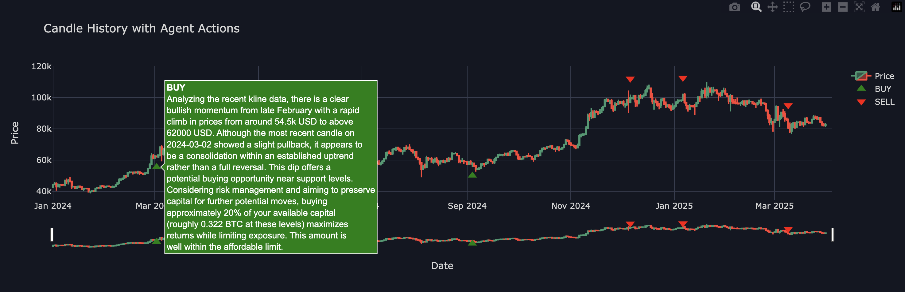
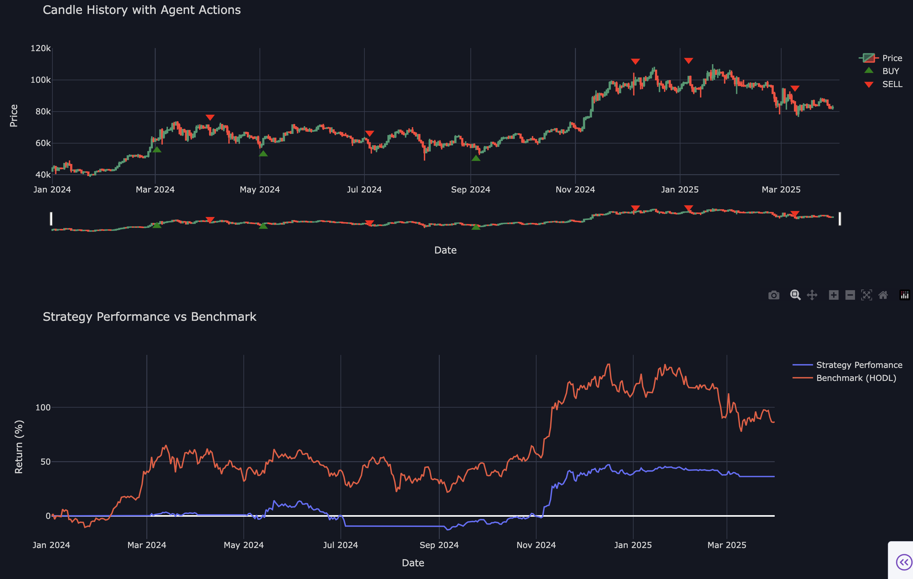
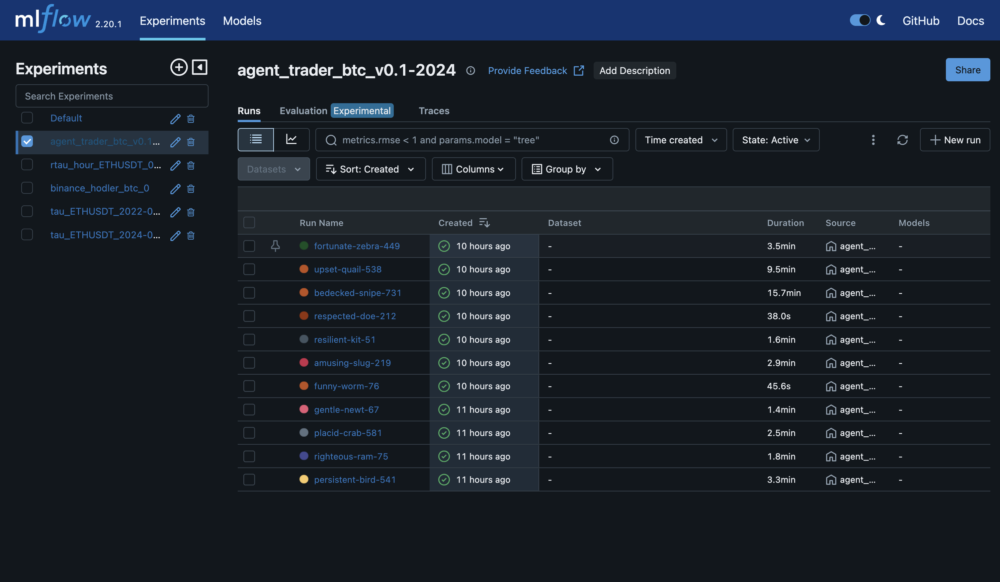
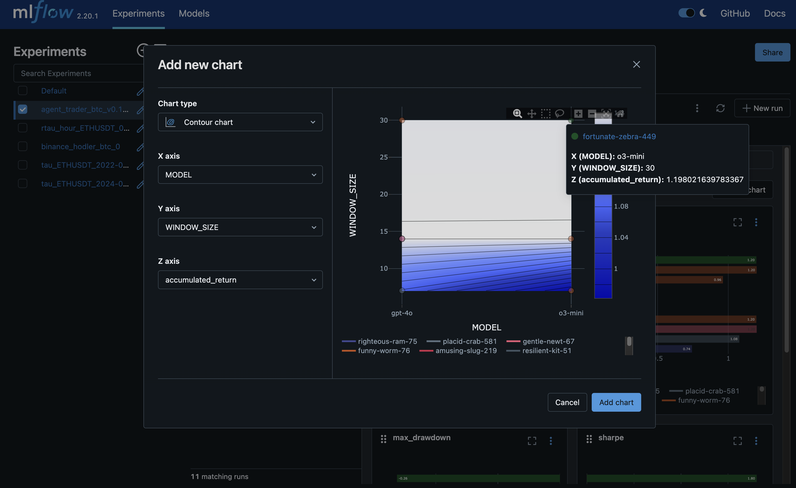

# AI Agent Backtesting Tool

This example provides a structured approach to creating, backtesting, and optimizing AI trading agents using historical market data, fractal strategies, and performance metrics.
It supports experimentation with different agent prompts, models, and strategy parameters using Python, MLFlow, and Dash visualization.

---

## 📋 Table of Contents
- [Overview](#overview)
- [Setup](#setup)
- [Creating Agents](#creating-agents)
- [Defining Strategies](#defining-strategies)
- [Running Backtests](#running-backtests)
- [Analyzing Results](#analyzing-results)
- [Grid Search & Experiments](#grid-search--experiments)
- [Dashboard Visualization](#dashboard-visualization)
- [MLFlow](#mlflow-integration)

---

## 📖 Overview

This tool enables you to perform automated backtests of AI-driven trading strategies. It leverages customizable agents powered by various LLM models, runs them against historical Binance data, and evaluates their performance using fractal analysis and standard financial metrics.

---

## 🛠️ Setup

**Install dependencies:**

```bash
pip install -r requirements.txt
```


---

## 🤖 Creating Agents

Create agents using factory functions `openai_agent.py`:

```python
from pydantic import BaseModel
from typing import List
from agents import Agent


class AgentAction(BaseModel):
    action: str
    amount: float
    reasoning: str


def create_agent(prompt: str, tools: List, model: str) -> Agent:
    return Agent(
        name="Trader",
        instructions=prompt,
        tools=tools,
        output_type=AgentAction,
        model=model
    )
```

Set up env:
```bash
export OPENAI_API_KEY=sk-proj...
```

---

## 🎛️ Defining Strategies

Set strategy parameters with dataclasses:

```python
@dataclass
class AgentTradingStrategyParams(BaseStrategyParams):
    INITIAL_BALANCE: float = 100_000
    WINDOW_SIZE: int = 30
    MODEL: str = 'o3-mini'
    PROMPT: str = "You are professional trader. Make decisions based on kline data."
```

Implement strategy logic by invoking agent actions:

```python
class AgentTradingStrategy(BaseStrategy):

    def __init__(self, debug: bool = False, params: AgentTradingStrategyParams | None = None,
                 observations_storage: ObservationsStorage | None = None):
        super().__init__(params=params, debug=debug, observations_storage=observations_storage)
        self._agent = self.__create_agent()
        self._window_size = self._params.WINDOW_SIZE

    def __create_agent(self) -> Agent:
        # override klines fetching to avoid market data leaking
        @function_tool
        def get_klines() -> List:
            return self.observations_storage.read()
        return create_agent(model=self._params.MODEL, tools=[get_klines], prompt=self._params.PROMPT)

    def set_up(self):
        self.register_entity(NamedEntity(entity_name='exchange', entity=SingleSpotExchange()))
        self.get_entity('exchange').action_deposit(self._params.INITIAL_BALANCE)

    def predict(self) -> ActionToTake:
        if self._window_size == 0:
            exchange: SingleSpotExchange = self.get_entity('exchange')
            internal_state = exchange.internal_state
            global_state = exchange.global_state
            res = Runner.run_sync(
                self._agent,
                (
                    f"You have {internal_state.cash} USD and {internal_state.amount} tokens. "
                    f"Max buy: {internal_state.cash / global_state.close}, Max sell: {internal_state.amount}."
                )
            )
            prediction: AgentAction = res.final_output
            self._window_size = self._params.WINDOW_SIZE
            if prediction.action.lower() == 'hold':
                return []
            return [ActionToTake(
                entity_name='exchange',
                action=Action(action=prediction.action.lower(), args={'amount': prediction.amount})
            )]
        else:
            self._window_size -= 1
            return []
```

---

## 🚀 Running Backtests

Run agent strategies on historical Binance data:

```python
binance_klines = BinanceKlinesLoader('BTCUSDT', interval='1d',
                                     start_time=datetime(2024, 1, 1), 
                                     end_time=datetime(2025, 4, 1),
                                     loader_type=LoaderType.CSV).read(with_run=True)

observations = [
    Observation(timestamp=ts, states={'exchange': SingleSpotExchangeGlobalState(open=o, high=h, low=l, close=c)})
    for ts, o, h, l, c in zip(binance_klines.index, binance_klines['open'],
                              binance_klines['high'], binance_klines['low'], binance_klines['close'])
]

params = AgentTradingStrategyParams()
strategy = AgentTradingStrategy(debug=True, params=params,
                                observations_storage=SQLiteObservationsStorage())
result = strategy.run(observations)

print(result.get_default_metrics())
result.to_dataframe().to_csv('result.csv')
```

```bash
python agent_strategy.py
StrategyMetrics(accumulated_return=0.3630, apy=0.2912, sharpe=1.0867, max_drawdown=-0.2368)
```

---

## 📊 Analyzing Results

The backtesting pipeline generates:

- **Logs** detailing agent actions.
- **Stepwise states** of the strategy and entities.
- **Performance metrics** (Return, APY, Sharpe, Drawdown).

---

## 🎨 Dashboard Visualization

We can use fractal artifacts to visualize backtest outcomes with Dash:

```bash
python dashboard.py
```

Dashboards include candle history, agent actions, and performance vs. benchmark:




---

## 🔎 Grid Search & Experiments

Optimize strategies with grid search:

```python
def build_grid() -> ParameterGrid:
    return ParameterGrid({
        'PROMPT': [BULLISH_PROMPT, BEARISH_PROMPT, NEUTRAL_PROMPT],
        'MODEL': ['gpt-4o', 'o3-mini'],
        'WINDOW_SIZE': [7, 14, 30],
        'INITIAL_BALANCE': [100_000]
    })

# Define MLFlow and Experiment configurations
mlflow_config: MLFlowConfig = MLFlowConfig(
    mlflow_uri='http://127.0.01:8080',
    experiment_name=f'agent_trader_btc_v0.1-2024'
)
experiment_config: ExperimentConfig = ExperimentConfig(
    strategy_type=AgentTradingStrategy,
    backtest_observations=build_observations(),
    observations_storage_type=SQLiteObservationsStorage,
    params_grid=build_grid(),
    debug=True,
)
pipeline: DefaultPipeline = DefaultPipeline(
    experiment_config=experiment_config,
    mlflow_config=mlflow_config
)
pipeline.run()
```

Start MLFlow server:
```bash
mlflow server --host 127.0.0.1 --port 8080
```

Run grid search with MLFlow logging:
```bash
python agent_pipeline.py
🏃 View run upset-quail-538 at: http://127.0.01:8080/#/experiments/322037600437979899/runs/0b62ce154e8740feb18ed8af9ec69dda
🧪 View experiment at: http://127.0.01:8080/#/experiments/322037600437979899
[non-fatal] Tracing: request failed: _ssl.c:983: The handshake operation timed out
🏃 View run fortunate-zebra-449 at: http://127.0.01:8080/#/experiments/322037600437979899/runs/e7cb3a4fbc004eaf8ebe6ee9821237e6
🧪 View experiment at: http://127.0.01:8080/#/experiments/322037600437979899
🏃 View run unequaled-fly-865 at: http://127.0.01:8080/#/experiments/322037600437979899/runs/637aaaacd21e4964beda27fdf6fcf8e8
🧪 View experiment at: http://127.0.01:8080/#/experiments/322037600437979899
```

---

## 🌐 MLFlow Integration

View MLFlow UI:
```
http://127.0.0.1:8080
```

Visualize experiment parameters and results clearly within MLFlow:


